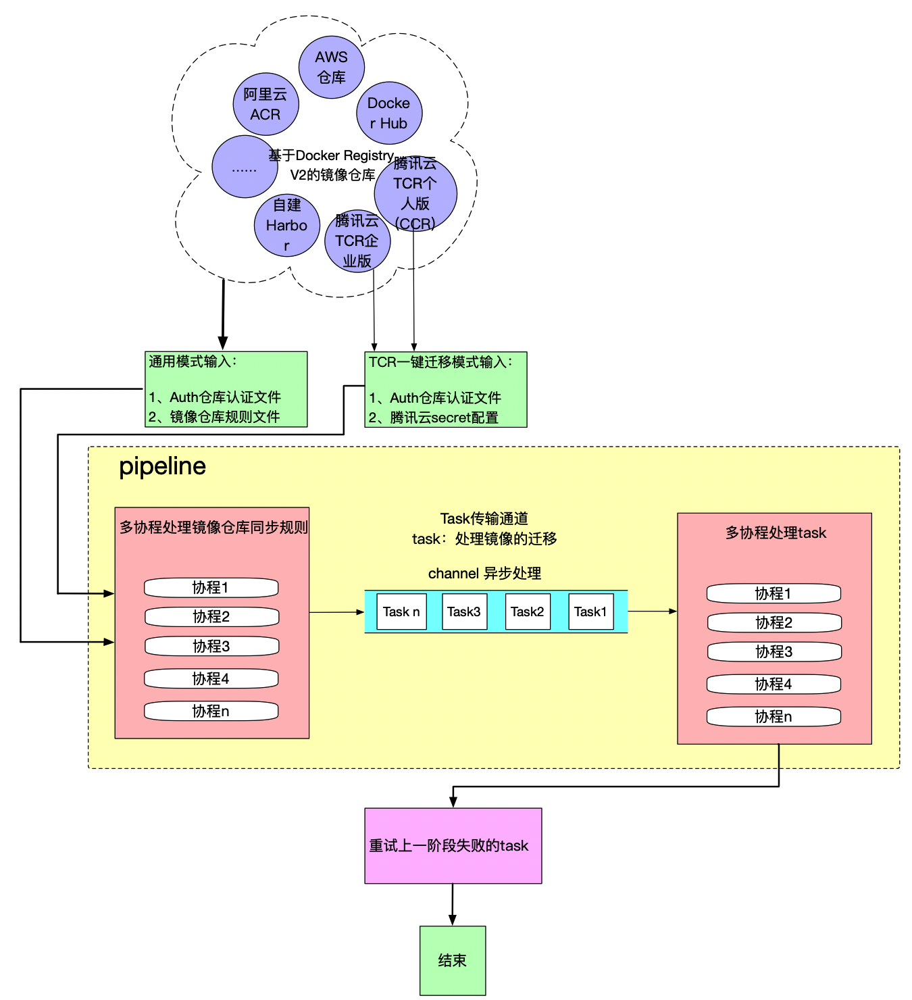

# 镜像迁移工具：image-transfer

`image-transfer` 是一个docker镜像迁移工具，用于对不同镜像仓库的镜像进行批量迁移。

## 特性

- 支持多对多镜像仓库迁移
- 支持腾讯云 TCR 个人版(CCR)一键全量迁移至企业版
- 支持基于 Docker Registry V2搭建的docker镜像仓库服务 (如 腾讯云TCR个人版(CCR)/TCR企业版、Docker Hub、 Quay、 阿里云镜像服务ACR、 Harbor等)
- **新增：支持OCI镜像格式同步，包括OCI Image Manifest**
- 支持自定义 qps 限速，避免迁移时对仓库造成过大压力
- 同步不落盘，提升同步速度
- 利用 pipeline 模型，提高任务执行效率
- 增量同步, 通过对同步过的镜像 blob 信息落盘，不重复同步已同步的镜像
- 并发同步，可以通过配置文件调整并发数
- 自动重试失败的同步任务，可以解决大部分镜像同步中的网络抖动问题
- 不依赖docker以及其他程序

## 模式

tcr镜像迁移工具具有两种运行模式：

- 通用模式：支持多种镜像仓库迁移
- 腾讯云 CCR 一键全量迁移模式：腾讯云 TCR 个人版(CCR) -> TCR企业版

## 新增功能：OCI镜像同步

image-transfer现在支持OCI镜像格式的同步，包括：

- OCI Image Manifest (v1.0+)
- Docker V2 Schema 2 格式

### OCI镜像同步特性

- **格式兼容**：支持Docker格式和OCI格式的镜像同步
- **增量同步**：智能检测已存在的镜像，避免重复传输

## 架构



## 使用

### 下载和安装

在[releases](https://github.com/tkestack/image-transfer/releases)页面可下载源码以及二进制文件

### 手动编译

```bash
git clone https://github.com/tkestack/image-transfer.git
cd ./image-transfer

# 编译
make
```

## 使用方法

### 使用帮助

```shell
./image-transfer -h
```

### 使用示例1：通用模式

设置镜像鉴权配置文件为 registry-secret.yaml，镜像迁移仓库规则文件为 transfer-rule.yaml，默认迁移目标为腾讯云 TCR 个人版：ccr.ccs.tencentyun.com，默认 namespace 为 default，并发数为 5，

```shell
./image-transfer --securityFile=./registry-secret.yaml --ruleFile=./transfer-rule.yaml \  
--ns=default --registry=ccr.ccs.tencentyun.com --routines=5 --retry=3
```

### 使用示例2：腾讯云 CCR 一键全量迁移模式

打开ccr迁移模式 ccrToTcr=true, 设置镜像仓库鉴权配置文件为 registry-secret.yaml，腾讯云 API 调用密钥配置文件为 tencentcloud-secret.yaml，默认个人版及企业版实例所在地域均为 ap-guangzhou（广州）
TCR 企业版实例示例名称为 image-transfer, 并发数为 5，失败重试次数为 3

```shell
./image-transfer --ccrToTcr=true --securityFile=./registry-secret.yaml --secretFile=./tencentcloud-secret.yaml \ 
--tcrName=image-transfer --tcrRegion=ap-guangzhou --ccrRegion=ap-guangzhou --routines=5 --retry=3
```

### 使用示例3：OCI镜像同步模式

同步OCI镜像：

```shell
./image-transfer --securityFile=./registry-secret.yaml --ruleFile=./transfer-rule.yaml \
--routines=5 --retry=3
```

### 配置文件参考

#### 腾讯云 API 密钥配置文件 tencentcloud-secret.yaml

如需迁移至腾讯云容器镜像服务内，需配置腾讯云 API 调用密钥，可前往 控制台-访问管理-访问密钥-API密钥管理 获取密钥对。如果在同账号下将 TCR 个人版数据迁移至企业版实例内，可共用同一套密钥。

```yaml
ccr:
    secretId: xxx
    secretKey: xxx
tcr:
    secretId: xxx
    secretKey: xxx
```

#### 镜像仓库鉴权配置文件 registry-secret.yaml

配置源目标及迁移目标镜像仓库的访问凭证，即 Docker Login 所使用的用户名，密码。

```yaml
ccr.ccs.tencentyun.com:
  username: xxx
  password: xxx
  insecure: true
image-transfer.tencentcloudcr.com:
  username: xxx
  password: xxx
registry.hub.docker.com:
  username: xxx
  password: xxx
registry.cn-guangzhou.aliyuncs.com:
  username: xxx
  password: xxx
acr.cn-guangzhou.cr.aliyuncs.com:
  username: xxx
  password: xxx
```

#### 镜像迁移仓库配置文件 transfer-rule.yaml

配置镜像迁移规则，即镜像仓库，镜像版本在源目标及迁移目标内的映射关系。

注：目前只支持 repo、tag 级别，且可同时配置多条镜像迁移规则。

```yaml
## tag
demo-ns/nginx:latest : image-transfer.tencentcloudcr.com/demo-ns/nginx:latest
## repo
registry.hub.docker.com/{ns1}/{repo1}: image-transfer.tencentcloudcr.com/{ns1}/{repo1}
registry.hub.docker.com/{ns2}/{repo2}: image-transfer.tencentcloudcr.com/{ns2}/{repo2}
```

## 注意事项

1. OCI镜像同步功能需要源和目标镜像仓库都支持OCI格式
2. 建议在生产环境使用前先进行小规模测试

## 故障排除

如果遇到OCI镜像同步问题，可以尝试：

1. 检查源和目标镜像仓库的OCI兼容性
2. 减少并发数`--routines`避免网络压力过大
3. 查看详细日志排查具体问题

## 版本历史

- v1.0.0: 初始版本，支持Docker镜像同步
- v1.1.0: 新增OCI镜像同步功能
